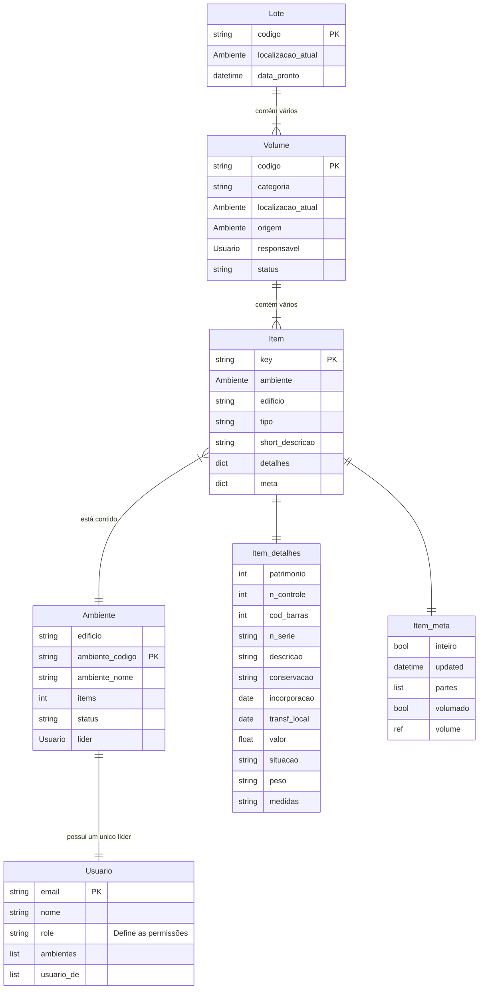

```mermaid
---
title Modelo do banco de dados
---
erDiagram 
    Ambiente{
        string edificio
        string ambiente_codigo  PK
        string ambiente_nome
        int items
        string status
        Usuario lider 
    } 
    Item }|--|| Ambiente: "está contido"
    Item{
        string key PK
        Ambiente ambiente
        string edificio
        string tipo
        string short_descricao 
        dict detalhes
        dict meta
    }
    Item ||--|| Item_detalhes: ""
    Item ||--|| Item_meta: ""
    Item_detalhes {
      int patrimonio 
      int n_controle 
      int cod_barras 
      string n_serie 
      string descricao 
      string conservacao  
      date incorporacao  
      date transf_local  
      float valor  
      string situacao  
      string peso 
      string medidas 
    }
    Item_meta {
        bool inteiro
        datetime updated
        list partes
        bool volumado
        ref volume
    }
    Ambiente ||--|| Usuario: "possui um unico líder"
    Usuario {
        string email PK
        string nome
        string role "Define as permissões"
        list ambientes
        list usuario_de
    }
    Volume {
        string codigo PK
        string categoria
        Ambiente localizacao_atual
        Ambiente origem
        Usuario responsavel
        string status 
    }
    Volume ||--|{ Item: "contém vários"
    Lote {
        string codigo PK
        Ambiente localizacao_atual
        datetime data_pronto
    }
    Lote ||--|{ Volume: "contém vários"
```
